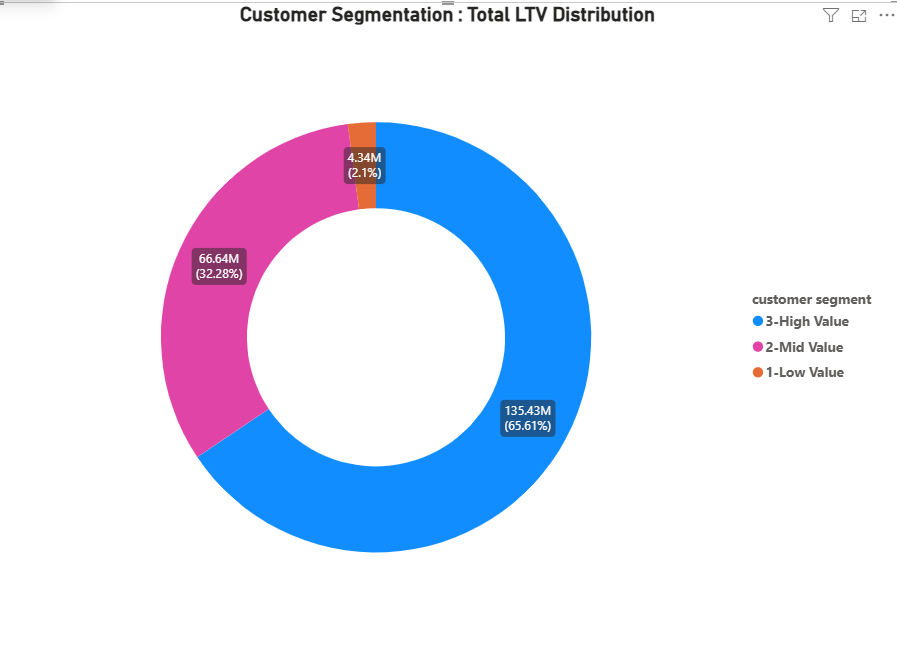
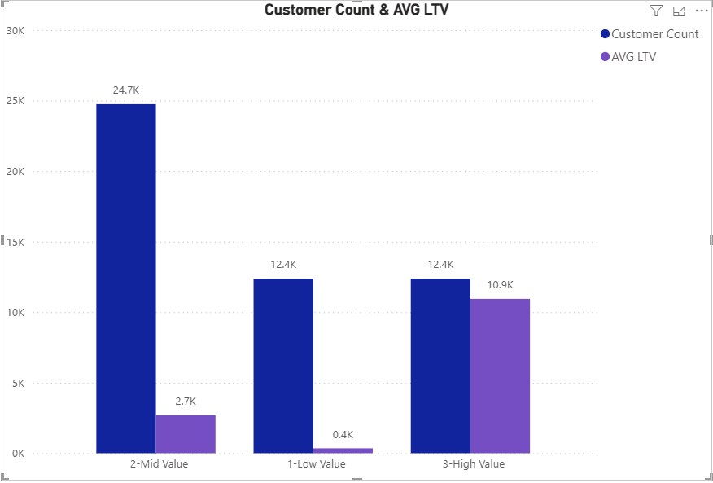

# Intermediate SQL – Sales Analysis

## Overview
This project analyzes sales data from a retail business using PostgreSQL,

focusing on three core financial metrics: customer lifetime value,
cohort revenue trends, and churn behavior.

The goal is to move beyond surface-level revenue numbers and uncover
the underlying patterns that drive — or threaten — long-term business performance.

## Business Questions
1.  **Customer Lifetime Value (LTV) Segmentation**: 

Which customer segment contributes the most to total revenue,
and what is the LTV gap between High and Low value customers?

2. **Cohort Revenue Analysis**:

 Which acquisition cohort generates the highest average revenue per customer, and how does this vary across years?

3. **Customer Churn Analysis**:

What percentage of customers have churned, and how many remain active?

## Analysis Approach

### 1. Customer Lifetime Value (LTV) Segmentation
### Analysis Approach
- Calculated total LTV per customer across all orders
- Used 25th and 75th percentiles to define segment boundaries
- Aggregated revenue and customer count per segment

🖥️ Query: [Q1](Q1-Customer_ltv_segmentation.sql)

**📊 Visualization:**

📊 **Key Findings:**
- High Value customers (25% of base) generate 64% of total revenue
- Mid Value has the largest customer count (24.7K) but low avg LTV (2,693)
- LTV gap between High and Low value is 30x (10,946 vs 350)

💡 **Business Insights**
- Focus retention efforts on High Value segment to protect
  the 64% revenue concentration risk
- Launch upsell programs targeting Mid Value customers
  to convert them into High Value tier
- Re-evaluate cost of serving Low Value customers,
  as acquisition cost may exceed their LTV
### 2. Cohort Revenue Analysis
- Tracked revenue and customer count per cohorts
- Cohorts were grouped by year of first purchase
- Analyzed ARPU at a cohort level

🖥️ Query: [Q2](Q2-cohort_analysis_luke.sql)

**📊 Visualization:**

📊 **Key Findings:**
- Although total revenue peaked in 2019 and 2022, ARPU has been declining steadily since 2015 
-  indicating that revenue growthis volume-driven rather than value-driven.
-This means the business is bringing in more customers over time, but each customer is individually spending less.
- While overall revenue numbers may look strong,the underlying trend raises concerns about long-term revenue sustainability.

💡 **Business Insights**
- Prioritize quality over quantity in customer acquisition —
  focus on attracting high-spend customers, not just volume
- Investigate why ARPU dropped sharply post-2016,
  as it may indicate a shift in targeting or pricing strategy
- Consider loyalty programs for early cohorts (2015–2016)
  who showed the highest individual spending behavior

### 3. Customer Churn Analysis
### Analysis Approach
- Ranked each customer's orders by date to isolate their last purchase
- Excluded new customers acquired in the last 6 months to ensure fair comparison
- Classified customers as Churned or Active based on 6-month inactivity threshold

🖥️ Query: [Q3](Q3-%20customer_churn_analysis.sql)

**📊 Visualization:**

📊 **Key Findings:**
- 90.53% of customers (42K) have churned — only 9.47% (4K) remain active
- The business is retaining less than 1 in 10 customers
- Churn is not a warning sign — it's an existing crisis

💡 **Business Insights**
- Immediate re-engagement campaigns needed for churned segment
  before they become unrecoverable
- High churn combined with declining ARPU (Q2) confirms
  the business has both retention and quality problems
- Retaining 5% more customers can increase revenue by 25-95%
  (Harvard Business Review benchmark)

## Strategic Recommendations

1. **Protect High Value customers first** 

 Launch a VIP retention program
   targeting the 25% of customers generating 64% of revenue,
   as losing them poses the highest financial risk to the business.

2. **Convert Mid Value to High Value** 

 Invest in upsell campaigns
   for the 24.7K Mid Value segment, as moving even 10% of them
   to High Value tier would significantly offset the declining ARPU trend.

3. **Address churn before scaling acquisition** 

 With 90% churn rate,
   spending on new customer acquisition is inefficient.
   Fixing retention first will deliver higher ROI
   than any growth campaign.

## Technical Details
- **Database** PostgreSQL
- **Analysis Tools** PostgreSQL
- **Visualization** Power BI
